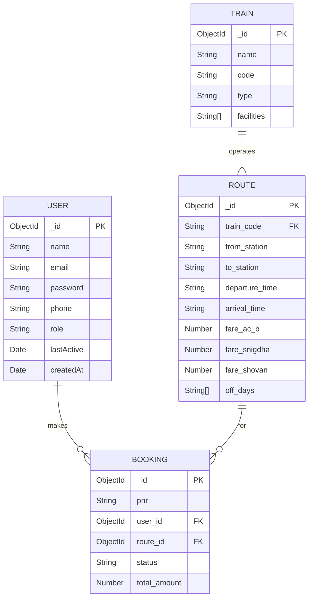

# System Design Document (SDD)
## Bangladesh Railway Management System

---

## 1. Introduction
This System Design Document (SDD) provides a detailed architectural overview of the Bangladesh Railway Management System. It serves as the primary reference for the system's technical implementation, covering database schemas, API specifications, and detailed design of core modules.

---

## 2. Database Design
The system utilizes **MongoDB**, a NoSQL document-oriented database, to ensure flexibility and scalability. Below are the detailed schema definitions derived from the Mongoose models.

### 2.1 Entity-Relationship Diagram (ERD)

### 2.2 Data Dictionary

#### **Collection: Users**
| Field | Type | Required | Unique | Description |
| :--- | :--- | :--- | :--- | :--- |
| `_id` | ObjectId | Yes | Yes | Primary Key. |
| `name` | String | Yes | No | Full name of the user. |
| `email` | String | Yes | Yes | Email address (used for login). |
| `password` | String | Yes | No | Hashed password (Bcrypt). |
| `phone` | String | No | No | Contact number. |
| `role` | String | Yes | No | 'Passenger' or 'Super Admin'. Default: 'Passenger'. |
| `lastActive` | Date | No | No | Timestamp of last user activity. |
| `createdAt` | Date | No | No | Account creation timestamp. |

#### **Collection: Trains**
| Field | Type | Required | Unique | Description |
| :--- | :--- | :--- | :--- | :--- |
| `_id` | ObjectId | Yes | Yes | Primary Key. |
| `name` | String | Yes | No | Name of the train (e.g., Suborno Express). |
| `code` | String | Yes | Yes | Unique train identifier (e.g., 701). |
| `type` | String | No | No | Type of train (e.g., Intercity, Mail). |
| `facilities`| Array | No | No | List of amenities (e.g., ['AC', 'Food']). |

#### **Collection: Routes**
| Field | Type | Required | Reference | Description |
| :--- | :--- | :--- | :--- | :--- |
| `_id` | ObjectId | Yes | - | Primary Key. |
| `train_code`| String | Yes | Train.code| Foreign key link to Train. |
| `from_station`| String | Yes | - | Source station. |
| `to_station`| String | Yes | - | Destination station. |
| `departure` | String | Yes | - | Time in 24h format (e.g., "14:30"). |
| `arrival` | String | Yes | - | Time in 24h format. |
| `fare_ac_b` | Number | No | - | Fare for AC Berth class. |
| `fare_snigdha`| Number | No | - | Fare for Snigdha/AC Chair. |
| `fare_shovan` | Number | No | - | Fare for Shovan Chair. |

#### **Collection: Bookings**
| Field | Type | Required | Reference | Description |
| :--- | :--- | :--- | :--- | :--- |
| `_id` | ObjectId | Yes | - | Primary Key. |
| `pnr` | String | Yes | - | Unique Booking ID (e.g., BR-12J9A). |
| `user_id` | ObjectId | Yes | User._id | Reference to the passenger. |
| `route_id` | ObjectId | Yes | Route._id| Reference to the journey route. |
| `journey_date`| String | No | - | Date of travel (YYYY-MM-DD). |
| `seats` | String | No | - | Comma-separated seat numbers (e.g., "Ka-1, Ka-2"). |
| `status` | String | Yes | - | 'Confirmed', 'Pending', or 'Cancelled'. |

---

## 3. API Documentation
The application follows RESTful principles. Below are the key endpoints.

### 3.1 Authentication (`/auth`)
*   **POST** `/auth/register`
    *   **Description:** Creates a new user account.
    *   **Body:** `{ name, email, password, phone }`
    *   **Response:** 201 Created, 400 Bad Request (if email exists).
*   **POST** `/auth/login`
    *   **Description:** Authenticates user and starts session.
    *   **Body:** `{ email, password }`
    *   **Response:** 200 OK (Redirect to Dashboard), 401 Unauthorized.
*   **GET** `/auth/logout`
    *   **Description:** Destroys session and redirects to home.

### 3.2 Booking (`/booking`)
*   **GET** `/booking/search`
    *   **Query Params:** `from`, `to`, `date`
    *   **Description:** Returns a list of available trains/routes matching criteria.
*   **POST** `/booking/create`
    *   **Body:** `{ route_id, seats, date, total_amount }`
    *   **Description:** Reserves seats and creates a booking record. Protected route.
*   **GET** `/booking/my-bookings`
    *   **Description:** Returns history of bookings for the logged-in user.

### 3.3 Admin Management (`/admin`) -- *Protected: Role='Super Admin'*
*   **GET** `/admin/dashboard`
    *   **Description:** Renders admin stats.
*   **POST** `/admin/add-train`
    *   **Body:** `{ name, code, type, facilities }`
    *   **Description:** Adds a new train to the fleet.
*   **POST** `/admin/add-route`
    *   **Body:** `{ train_code, from, to, departure, arrival, fares }`
    *   **Description:** Assigns a route to a train.

---

## 4. Interface Design
This section outlines the layout and flow of key application pages.

### 4.1 Home Page
*   **Header:** Logo, Navigation (Home, Verify Ticket, Login/Register).
*   **Hero Section:** Search Widget (From Station, To Station, Date, Class).
*   **Information:** "How to Buy", "Features", "Acceptable Payment Methods".
*   **Footer:** Contact info, Links.

### 4.2 Search Results Page
*   **Filter Sidebar:** Filter by Train Type, Departure Time.
*   **Train Cards:** Each card displays:
    *   Train Name & Code
    *   Departure & Arrival Time
    *   Available Seats Count (per class)
    *   "Book Now" button.

### 4.3 Admin Dashboard
*   **Sidebar:** Dashboard, Train Manager, Route Manager, Booking Manager, Users.
*   **Main Content:**
    *   **Stats Cards:** Total Tickets Sold, Total Income, Active Trains.
    *   **Recent Bookings Table:** List of latest transaction attempts.

---

## 5. Security & Authorization
*   **Password Hashing:** Implemented using `bcryptjs` with a salt round of 10. Passwords are never stored in plain text.
*   **Session Security:** `express-session` with `connect-mongo` stores session data server-side. Cookies are `HttpOnly` to prevent XSS access.
*   **Middleware:**
    *   `ensureAuthenticated`: applied to user dashboard and booking routes.
    *   `ensureAdmin`: applied to all `/admin` routes to prevent unauthorized access.
